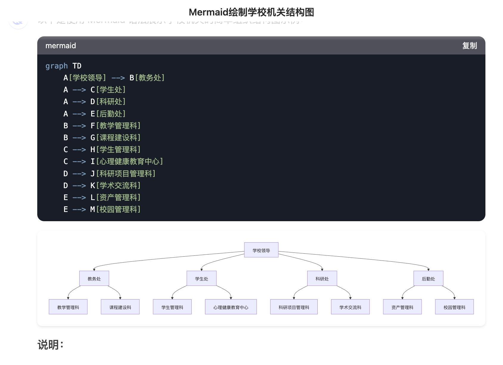

# 🌊 Mermaid 实时渲染器

一个浏览器扩展程序，可以在 deepseek 的对话页面上实时渲染 Mermaid 图表。该工具能够自动检测并渲染新添加到 DOM 中的 Mermaid 代码块，为用户提供流畅的图表使用体验。




## 🚀 功能特点

- **实时渲染**：当新的 Mermaid 代码块被添加到页面时自动渲染图表
- **动态更新**：监控 DOM 变化并更新图表，无需刷新页面
- **错误处理**：遇到渲染问题时显示错误信息
- **自动识别**：自动识别页面中的 Mermaid 代码块

## 📦 安装说明

1. 克隆仓库：
   ```bash
   git clone https://github.com/luzhengli/DSEnhancer.git
   ```

2. 进入项目目录：
   ```bash
   cd DSEnhancer
   ```

3. 在浏览器中加载扩展：
   - Chrome 浏览器：
     - 访问 `chrome://extensions/`
     - 开启"开发者模式"
     - 点击"加载已解压的扩展程序"并选择项目目录
   - Firefox 浏览器（待兼容）：
     - 访问 `about:debugging#/runtime/this-firefox`
     - 点击"临时载入附加组件"并选择 `manifest.json` 文件

## 🛠️ 使用方法

1. 打开包含 Mermaid 代码块的网页
2. 扩展程序会自动检测并渲染新添加的 Mermaid 图表
3. 无需任何手动操作，图表会自动显示在代码块下方

## 💻 技术实现

- 使用 MutationObserver 监控 DOM 变化
- 实时检测新添加的 Mermaid 代码块
- 通过 Mermaid.js 库进行图表渲染
- 采用异步处理确保渲染性能

## 📜 代码示例

```javascript
// Mermaid 代码块示例
graph TD
    A[开始] --> B{判断}
    B -- Yes --> C[执行]
    B -- No --> D[结束]
```

## 🤝 参与贡献

欢迎提交贡献！请按以下步骤操作：

1. Fork 本仓库
2. 创建新的功能分支：
   ```bash
   git checkout -b feature/新功能名称
   ```
3. 提交您的更改：
   ```bash
   git commit -m "添加新功能"
   ```
4. 推送到分支：
   ```bash
   git push origin feature/新功能名称
   ```
5. 提交 Pull Request

## 🐛 问题反馈

如果您在使用过程中遇到任何问题，请：

1. 查看 [Issues](https://github.com/yourusername/mermaid-real-time-renderer/issues) 页面是否有类似问题
2. 如果没有找到相关问题，请创建新的 Issue
3. 在 Issue 中详细描述问题，最好附上截图或复现步骤

## 📄 开源协议

本项目采用 MIT 协议 - 详见 [LICENSE](LICENSE) 文件

## 🙏 致谢

- 感谢 [Mermaid](https://mermaid-js.github.io/mermaid/#/) 提供图表渲染库
- 感谢所有贡献者的支持和帮助

## 📅 更新日志

### v1.0.0
- 实现实时渲染功能
- 添加错误处理机制
- 支持自动识别 Mermaid 代码块